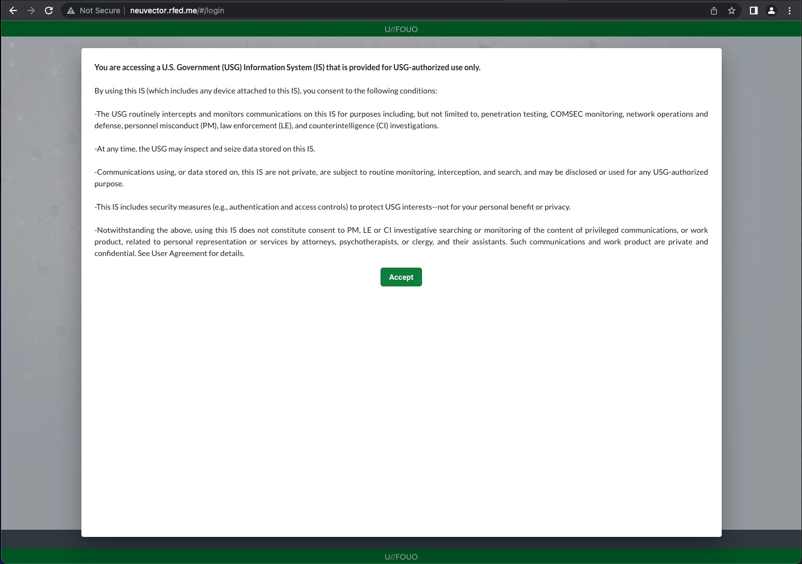

# New Neuvector Classification Support


Recently the Neuvector team released Neuvector version 5.2. This new feature added some much needed features for our Government customers. This post will walk through those features and how implement them.

---

> **Table of Contents**:
>
> * [New Neuvector Classification Support](#new-neuvector-classification-support)
>   * [What is New?](#what-is-new)
>     * [Customizable Login Banner](#customizable-login-banner)
>     * [Customizable UI Header/Footer](#customizable-ui-headerfooter)
>   * [Helm You Say?](#helm-you-say)
>   * [Conclusion](#conclusion)

---

## What is New?

As with most releases, there are many new features in [Neuvector 5.2](https://github.com/neuvector/neuvector/releases/tag/v5.2.0). There are two specifically that interest our costomers, Customizable login banner and Customizable UI header text. Lets look at them individually. 

### Customizable Login Banner

The new feature, Customizable Login Banner, allows Neuvector to display a login consent banner. This is required for some areas of the Government. We can look at a finding from the [STIG Viewer](https://www.stigviewer.com/stig/aix_5.3/2014-10-03/finding/V-24331). Basically this is a requirement for the US Government. Here is the text.

```txt
You are accessing a U.S. Government (USG) Information System (IS) that is provided for USG-authorized use only.

By using this IS (which includes any device attached to this IS), you consent to the following conditions:

-The USG routinely intercepts and monitors communications on this IS for purposes including, but not limited to, penetration testing, COMSEC monitoring, network operations and defense, personnel misconduct (PM), law enforcement (LE), and counterintelligence (CI) investigations.

-At any time, the USG may inspect and seize data stored on this IS.

-Communications using, or data stored on, this IS are not private, are subject to routine monitoring, interception, and search, and may be disclosed or used for any USG-authorized purpose.

-This IS includes security measures (e.g., authentication and access controls) to protect USG interests--not for your personal benefit or privacy.

-Notwithstanding the above, using this IS does not constitute consent to PM, LE or CI investigative searching or monitoring of the content of privileged communications, or work product, related to personal representation or services by attorneys, psychotherapists, or clergy, and their assistants. Such communications and work product are private and confidential. See User Agreement for details.
```

We can take a look at the [Neuvector Docs](https://open-docs.neuvector.com/configuration/customui) for the specific implementation. One thing to note is that we need to `base64` encode the text. And fun tidbit is that we can add html for formatting.



Next let's take a look at the next new feature.

### Customizable UI Header/Footer

The next new feature is Customizable UI Header/Footer allows Neuvector to display classification and control markings. 

*Classification and Control Markings are required for digital products created for government clients who interact with classified or controlled information.*

There is a great article from Astro that highlights the [requirements](https://www.astrouxds.com/components/classification-markings/#official-requirements). They also have a great [banner example](https://www.astrouxds.com/components/classification-markings/#banner-examples) table that shows the Hex Values for the colors.


Now we start to actually implement the banners.

## Helm You Say?

Please keep in mind that this is subject to change. Currently we need update our [Helm](https://helm.sh/) chart for [Neuvector](https://github.com/neuvector/neuvector-helm/tree/master/charts/core). Please don't forget the update the local chart first.

```bash
helm repo update
```

If we are starting from scratch we can install and pull with:

```bash
# install helm
curl -s https://raw.githubusercontent.com/helm/helm/main/scripts/get-helm-3 | bash

# download/update the local chart
helm repo add neuvector https://neuvector.github.io/neuvector-helm/ --force-update
```

Once we have the chart here we should update the `values.yaml` with the options we need. Below is an UNCLASS example. Take a look at the inline comments.

```yaml
controller:
  pvc:
    capacity: 500Mi # for stateful storage
    enabled: true
internal:
  certmanager:
    enabled: true # for better internal communication security
k3s:
  enabled: true # for k3s/rke2
manager:
  env:
    envs:
    - name: CUSTOM_PAGE_HEADER_COLOR 
      value: '#007a33' # Unclass header background
    - name: CUSTOM_PAGE_HEADER_CONTENT
      value: VS8vRk9VTwo= # base64 encoded "U//FOUO"
    - name: CUSTOM_PAGE_FOOTER_COLOR
      value: '#007a33' # Unclass footer background
    - name: CUSTOM_PAGE_FOOTER_CONTENT
      value: VS8vRk9VTwo= # base64 encoded "U//FOUO"
    - name: CUSTOM_EULA_POLICY
      value: PGI+WW91IGFyZSBhY2Nlc3NpbmcgYSBVLlMuIEdvdmVybm1lbnQgKFVTRykgSW5mb3JtYXRpb24gU3lzdGVtIChJUykgdGhhdCBpcyBwcm92aWRlZCBmb3IgVVNHLWF1dGhvcml6ZWQgdXNlIG9ubHkuPC9iPjxicj4KPGJyPgpCeSB1c2luZyB0aGlzIElTICh3aGljaCBpbmNsdWRlcyBhbnkgZGV2aWNlIGF0dGFjaGVkIHRvIHRoaXMgSVMpLCB5b3UgY29uc2VudCB0byB0aGUgZm9sbG93aW5nIGNvbmRpdGlvbnM6PGJyPgo8YnI+Ci1UaGUgVVNHIHJvdXRpbmVseSBpbnRlcmNlcHRzIGFuZCBtb25pdG9ycyBjb21tdW5pY2F0aW9ucyBvbiB0aGlzIElTIGZvciBwdXJwb3NlcyBpbmNsdWRpbmcsIGJ1dCBub3QgbGltaXRlZCB0bywgcGVuZXRyYXRpb24gdGVzdGluZywgQ09NU0VDIG1vbml0b3JpbmcsIG5ldHdvcmsgb3BlcmF0aW9ucyBhbmQgZGVmZW5zZSwgcGVyc29ubmVsIG1pc2NvbmR1Y3QgKFBNKSwgbGF3IGVuZm9yY2VtZW50IChMRSksIGFuZCBjb3VudGVyaW50ZWxsaWdlbmNlIChDSSkgaW52ZXN0aWdhdGlvbnMuPGJyPgo8YnI+Ci1BdCBhbnkgdGltZSwgdGhlIFVTRyBtYXkgaW5zcGVjdCBhbmQgc2VpemUgZGF0YSBzdG9yZWQgb24gdGhpcyBJUy48YnI+Cjxicj4KLUNvbW11bmljYXRpb25zIHVzaW5nLCBvciBkYXRhIHN0b3JlZCBvbiwgdGhpcyBJUyBhcmUgbm90IHByaXZhdGUsIGFyZSBzdWJqZWN0IHRvIHJvdXRpbmUgbW9uaXRvcmluZywgaW50ZXJjZXB0aW9uLCBhbmQgc2VhcmNoLCBhbmQgbWF5IGJlIGRpc2Nsb3NlZCBvciB1c2VkIGZvciBhbnkgVVNHLWF1dGhvcml6ZWQgcHVycG9zZS48YnI+Cjxicj4KLVRoaXMgSVMgaW5jbHVkZXMgc2VjdXJpdHkgbWVhc3VyZXMgKGUuZy4sIGF1dGhlbnRpY2F0aW9uIGFuZCBhY2Nlc3MgY29udHJvbHMpIHRvIHByb3RlY3QgVVNHIGludGVyZXN0cy0tbm90IGZvciB5b3VyIHBlcnNvbmFsIGJlbmVmaXQgb3IgcHJpdmFjeS48YnI+Cjxicj4KLU5vdHdpdGhzdGFuZGluZyB0aGUgYWJvdmUsIHVzaW5nIHRoaXMgSVMgZG9lcyBub3QgY29uc3RpdHV0ZSBjb25zZW50IHRvIFBNLCBMRSBvciBDSSBpbnZlc3RpZ2F0aXZlIHNlYXJjaGluZyBvciBtb25pdG9yaW5nIG9mIHRoZSBjb250ZW50IG9mIHByaXZpbGVnZWQgY29tbXVuaWNhdGlvbnMsIG9yIHdvcmsgcHJvZHVjdCwgcmVsYXRlZCB0byBwZXJzb25hbCByZXByZXNlbnRhdGlvbiBvciBzZXJ2aWNlcyBieSBhdHRvcm5leXMsIHBzeWNob3RoZXJhcGlzdHMsIG9yIGNsZXJneSwgYW5kIHRoZWlyIGFzc2lzdGFudHMuIFN1Y2ggY29tbXVuaWNhdGlvbnMgYW5kIHdvcmsgcHJvZHVjdCBhcmUgcHJpdmF0ZSBhbmQgY29uZmlkZW50aWFsLiBTZWUgVXNlciBBZ3JlZW1lbnQgZm9yIGRldGFpbHMuIDxicj4gCg==
  ingress:
    enabled: true # enable ingress object
    host: neuvector.rfed.me # domain name for ingress, change to your domain
  svc:
    type: ClusterIP # for better application exposure
```

Now that we have the `values.yaml` all set we can simply `helm apply`.

```bash
# run in same directory with the values.yaml
helm upgrade -i neuvector -n neuvector neuvector/core --create-namespace -f values.yaml
```

Wait a minute for everything to load and navigate to the web page.


## Conclusion

As you can see, we can easily add the Classification and Control markings for Neuvector. Once your Helm chart is updated we can apply the new banners to you current and future deployments of Neuvector.

### Disclaimer

“This publication was prepared or accomplished by the author in a personal capacity. All opinions expressed by the author of this publication are solely their current opinions and do not reflect the opinions of Rancher Federal, Inc., respective parent companies, or affiliates with which the author is affiliated. The author's opinions are based upon information they consider reliable, but neither Rancher Federal, Inc., nor its affiliates, nor the companies with which the author is affiliated, warrant its completeness or accuracy, and it should not be relied upon as such.”
